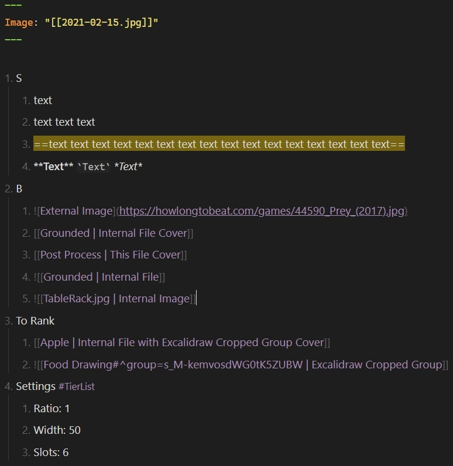

# Tier List 

This plugin allows you to render nested lists as visual Tier Lists, providing an intuitive way to organize, rank, and display items using customizable tiers.

One of the core features of the plugin is the ability to render lists with both internal and external images, any markdown text, or covers linked via a file's frontmatter. You can specify an image for a file in the frontmatter using the `Image` key, which will serve as a visual cover for that file in the tier list.

Unlike tools like Dataview, where sorting often requires defining custom variables, the Tier List plugin enables manual sorting of list items. This is useful when, for instance, you want to rank movies by genre without assigning them specific numerical ratings. Instead, you can place each movie relative to others, making it easier to say one movie is better than another but worse than a third. The manual nature of this ranking gives more flexibility and avoids the complexity of absolute ratings.

Using markdown links within a Tier List ensures that all items maintain their relationships in Obsidian’s Graph View. This keeps the graph clean and organized while still connecting your notes through the Tier List file.

To use the Tier List plugin, you can either insert the `#TierList` tag anywhere within a numbered list, which marks the list for tier rendering, or use the command `Insert tier list` to automatically create a list preformatted for ranking.

Tier List also includes a “To Rank” section, where items that have not yet been placed in a specific tier will be shown. This section collapses automatically once it becomes empty, keeping the view clean and focused on ranked items.

## Settings

The plugin provides several customization options. You can define default settings for all Tier Lists globally, but you can also override these settings on a per-list basis. To do so, create a `Settings` section in the list and use `key: value` pairs to adjust available parameters.

| Parameter | Description                                                |
| --------- | ---------------------------------------------------------- |
| Ratio     | Aspect ratio of the slot                                   |
| Width     | Width of the Tier List as a percentage of the display size |
| Slots     | Number of slots per row                                    |