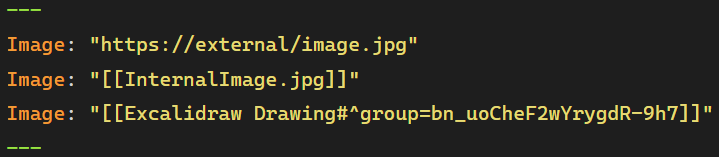

# Tier List 

This plugin allows you to render nested lists as visual Tier Lists, providing an intuitive way to organize, rank, and display items using customizable tiers.

One of the core features of the plugin is the ability to render lists with both internal and external images, any markdown text, or covers linked via a file's frontmatter. You can specify an image for a file in the frontmatter using the `Image` key, which will serve as a visual cover for that file in the tier list.

## Tier List Philosophy

Unlike tools like Dataview, where sorting often requires defining custom variables, the Tier List plugin enables manual sorting of list items. This is useful when, for instance, you want to rank movies by genre without assigning them specific numerical ratings. Instead, you can place each movie relative to others, making it easier to say one movie is better than another but worse than a third. The manual nature of this ranking gives more flexibility and avoids the complexity of absolute ratings.

Using markdown links within a Tier List ensures that all items maintain their relationships in Obsidian’s Graph View. This keeps the graph clean and organized while still connecting your notes through the Tier List file.

## How to use

To use the Tier List plugin, you can either insert the `#tier-list` *(can be changed in plugin settings)* tag anywhere within a numbered list, which marks the list for tier rendering, or use the command `Insert tier list` to automatically create a list preformatted for ranking.

Tier List also includes a `To Rank` section, where items that have not yet been placed in a specific tier will be shown. This section collapses automatically once it becomes empty, keeping the view clean and focused on ranked items.

### Interaction

The Tier List plugin supports interaction in both **Editing View** and **Reading View**, each offering different workflows.

- In **Editing View**, you can create and modify the list just like a regular markdown list—simply type items, add text fields, embed images, etc. This mode is ideal for quickly writing and organizing content without extra formatting.
- In **Reading View**, interaction is handled through a **right-click menu**, where you can choose options and edit details in **modal windows**. For quick edits, you can also **double-click** on an item to modify it instantly. You can navigate to a note or a linked file by `Ctrl/⌘ + Click` on the corresponding slot.

If you need **fast text input** without additional styling, **Editing View** is the best choice. However, if you want **more customization**, including colors, transformations, and extra features, **Reading View with modal editing** provides a better experience.

## Settings

The plugin provides several customization options. You can define default settings for all Tier Lists globally, but you can also override these settings on a per-list basis. To do so, right-click on the tier list in the reading view and select `Settings`.

## Dataview Integration
This plugin integrates with [Dataview](https://blacksmithgu.github.io/obsidian-dataview/queries/data-commands/#from), allowing you to supplement your tier lists with missing notes using Dataview queries.

### How It Works
1. Right-click in the relevant area to open the context menu and select `Request`.
2. In the modal window, configure the query settings (`From`, `Where`).
3. The plugin will retrieve matching notes and add missing entries to your tier list.

### Settings Persistence
- The last used query is saved in the settings list for future use.
- You can quickly reapply previous queries without manually re-entering them.
- In addition to using the modal window, you can quickly add missing entries by **right-clicking** in the relevant area and selecting `Add Missing` from the context menu.
